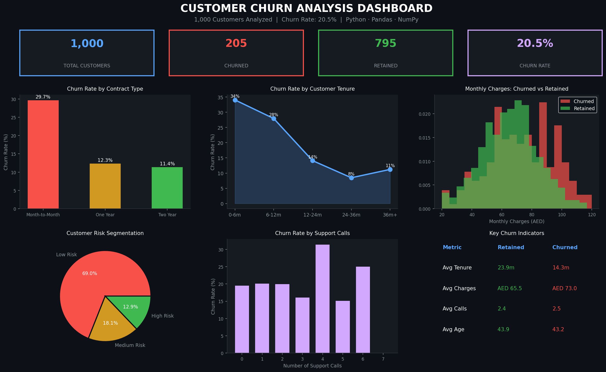

# Customer Churn Analysis

*Tools:* Python · Pandas · NumPy · SQL · Matplotlib

## Overview
End-to-end analysis of 1,000 customer records to identify key churn
drivers and propose data-driven retention strategies. Analyzed behavioral
patterns to segment customers by risk level.

## Key Results
- Identified churn rate of *20.5%* across the customer base
- Pinpointed top 3 churn drivers: short tenure, high monthly charges, frequent support calls
- Segmented customers into High / Medium / Low risk groups
- Proposed targeted retention strategies for high-risk segments

## Dashboard Preview

## Project Steps
1. Dataset generation and inspection
2. Data cleaning and preprocessing (Pandas, NumPy)
3. Exploratory Data Analysis (EDA)
4. Churn indicator identification
5. Customer risk segmentation
6. Retention strategy recommendations

## Files
- customer_churn_analysis.py — Full Python analysis script
- customer_data.csv — Customer dataset (1,000 records)

## How to Run
1. Download customer_churn_analysis.py
2. Open in VS Code or run: python customer_churn_analysis.py
